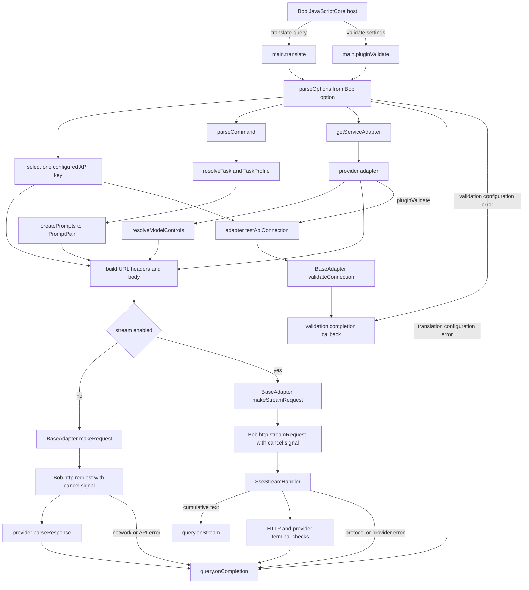

# Maintainer orientation

Implementation verified: 2026-08-31 at `a4c0b75`.

This guide is the shortest path from an unfamiliar checkout to a working model
of the plugin. Read [architecture.md](./architecture.md) for design rationale and
source coverage, read the [Pop product contract](./product_contract.md) before
implementing action behavior, and use [bob_smoke_test.md](./bob_smoke_test.md)
when validating an installed package.

## Working model

The shipped plugin is a small JavaScriptCore program hosted by Bob. It has five
separate responsibilities:

1. The Bob entry point receives a query or a validation request.
2. Configuration code turns Bob's flat string options into one immutable
   runtime configuration.
3. The action engine parses one explicit command or resolves a deterministic
   default task, then builds provider-neutral system and user text.
4. A provider adapter translates shared prompt and model-control inputs into a
   provider-specific wire request and response.
5. Shared transport code owns cancellation, streaming, terminal checks, and the
   final Bob callback.

Task semantics and provider transport are deliberately different axes. Command
parsing, task profiles, default routing, and prompt construction all finish
before a provider codec receives a `PromptPair`. The frozen behavior and entry
points are defined in the [product contract](./product_contract.md).

## Source-of-truth order

When evidence disagrees, use this order:

1. Behavior observed from the copied, installed plugin in Bob
2. Runtime source plus focused tests
3. Packaged `main.js` and `info.json`
4. Type declarations and repository documentation

Bob is a JavaScriptCore host, not Node.js or a browser. Passing tests in Bun is
necessary but cannot prove host callbacks, settings rendering, package update
ordering, or JavaScriptCore compatibility.

## Recommended reading order

| Order | File | Question it answers |
| ---: | --- | --- |
| 1 | `public/info.json` | What does Bob display and persist? |
| 2 | `src/main.ts` | Which functions does Bob call? |
| 3 | `src/config.ts` and `src/types.ts` | How do strings become a provider, protocol, and immutable config? |
| 4 | `src/action/command.ts`, `profiles.ts`, and `resolve.ts` | How is one action selected without provider knowledge? |
| 5 | `src/utils/prompt.ts` | How does a resolved task become one `PromptPair`? |
| 6 | `src/utils/model-capabilities.ts` | Which optional model controls are safe to send? |
| 7 | `src/adapter/index.ts` and one provider adapter | How is the wire codec selected and shaped? |
| 8 | `src/adapter/base.ts` | Where do transport, cancellation, validation, and terminal callbacks live? |
| 9 | `src/utils/sse.ts` | How are arbitrary SSE chunks converted into cumulative Bob stream updates? |
| 10 | `src/utils/error.ts` | How are thrown values normalized into `ServiceError`? |
| 11 | `scripts/build.mts`, `scripts/check-runtime.mts`, `scripts/package.mts` | How does source become an installable package? |
| 12 | `src/**/__tests__`, `scripts/__tests__`, `tests/live` | Which contracts are static, mocked, or opt-in live checks? |

## Request lifecycle

The important boundaries are:

- `main.ts` orchestrates Bob entry functions but does not know provider wire
  formats.
- `parseOptions()` is the only reader of Bob's `$option` values. Adapters receive
  a validated `PluginConfig` and never read global settings.
- `parseCommand()` and `resolveTask()` are pure provider-neutral steps. Unknown
  commands, empty bodies, and invalid Custom settings complete before a request.
- Prompt construction produces one provider-neutral `PromptPair`. Provider
  adapters place it into `instructions`/`input`, `messages`, or Gemini
  `contents` without choosing or interpreting the action.
- Model capability resolution produces a small normalized control object.
  Adapters translate it into `reasoning`, `reasoning_effort`, `thinkingConfig`,
  or `thinking`.
- `BaseAdapter` shares request lifecycle behavior. Provider adapters own URLs,
  authentication, payloads, response extraction, provider errors, stream event
  shapes, and validation contracts.
- `SseStreamHandler` receives arbitrary text chunks, parses real SSE events, and
  sends cumulative text to Bob. It is independent of model capability rules.

## Configuration and dispatch

`parseOptions()` resolves configuration in this order:

1. Resolve the selected or custom model, with `gpt-5.6-luna` as the runtime
   fallback.
2. Normalize an optional API URL and require a complete path ending in
   `/responses` or `/chat/completions`.
3. If no URL is configured, use the exact model catalog, then the `gemini-` or
   `MiniMax-` prefix, and otherwise default to official OpenAI.
4. If a URL is configured, detect Azure from its host or path, retain the native
   MiniMax codec for verified official MiniMax Chat Completions hosts, and route
   every other URL through the OpenAI-compatible adapter.
5. Parse reasoning, streaming, shared requirements, and one optional Custom
   action; freeze the API-key array and final configuration.

The URL selects the protocol before adapter construction. This prevents a
provider menu, base URL field, and API path field from becoming three separate
sources of truth.

## Streaming and terminal behavior

The two request modes converge on `query.onCompletion`, but their mechanics are
different:

- Non-streaming uses Bob's promise-returning `$http.request`, checks HTTP status,
  parses one provider response, and returns the entire text as one paragraph.
- Streaming uses callback-based `$http.streamRequest`. The implementation does
  not assume that this Bob API also returns a Promise. It waits for the terminal
  `handler`, while each `streamHandler` chunk feeds the SSE parser.
- OpenAI Responses streams must include a successful `response.completed`
  event. Chat Completions, Gemini, and MiniMax currently finish when Bob's HTTP
  handler succeeds and non-empty text has been collected.
- Provider error events are checked before deltas. Plain JSON error bodies sent
  through the stream callback are also captured.
- Invalid event JSON, a truncated required terminal event, an empty response,
  and an SSE parser buffer over 1 MiB are failures rather than empty successes.
- MiniMax cumulative stream content is converted back to deltas before the
  shared handler appends it. `reasoning_split` and fallback `<think>` removal
  keep reasoning out of translated text.

Streaming and validation paths have explicit terminal guards, so late or
repeated callbacks do not produce another completion. The non-streaming path
has one terminal branch for each normal result, but it assumes Bob's
`query.onCompletion` itself does not throw. That host assumption belongs in the
Bob smoke test; Bun tests cannot prove it.

## Module ownership and change entry points

| Change | Primary entry | Usually also update | Boundary to preserve |
| --- | --- | --- | --- |
| Add an action or task | `src/action/command.ts`, `profiles.ts`, and `resolve.ts` | Prompt tests, command-routing tests, user docs | Do not put task routing in provider adapters |
| Change task prompts or variables | `src/utils/prompt.ts` | Profile/prompt tests, settings metadata, both manuals | Keep runtime text out of system instructions |
| Add a provider | `src/types.ts`, `src/config.ts`, `src/adapter/index.ts`, new adapter | Provider and transport tests, manuals, architecture sources | Reuse `BaseAdapter`; keep credentials and wire rules in the adapter |
| Add a protocol to an existing provider | Provider adapter plus `ApiProtocol` and URL detection | Request-body, response, stream, and validation tests | Do not infer native formats from arbitrary URLs |
| Add a curated model | `MODEL_CATALOG` | Sorted `public/info.json` model menu, metadata/docs tests, both manuals | A catalog entry does not imply optional capability support |
| Add a model control | `resolveModelControls()` | Provider body tests and current official source in `architecture.md` | Unknown models receive no speculative optional parameters |
| Add or rearrange a setting | `public/info.json`, `parseOptions()` | Metadata/config tests and both manuals | Bob's form is static; preserve saved-setting compatibility deliberately |
| Change cancellation or completion | `src/adapter/base.ts` | Transport tests plus installed Bob smoke tests | Every normal terminal path must complete once |
| Change SSE parsing | `src/utils/sse.ts` | Chunk-boundary, malformed-input, provider-error, and buffer tests | Keep a real bounded parser |
| Change packaging or release | `scripts/package.mts`, workflow files | Package tests, copied archive metadata, Appcast checks | Development builds must not mutate repository release metadata |

## Runtime and tooling boundary

| Shipped runtime | Development only |
| --- | --- |
| JavaScript built-ins | Bun runtime and test runner |
| Bob globals such as `$option` and `$http` | TypeScript and Biome |
| Bundled pure JavaScript (`eventsource-parser`) | `node:` modules inside `scripts/` |
| One CommonJS `main.js` | `fetch` in explicitly opted-in live tests |
| `info.json` and `icon.png` | Build, benchmark, packaging, and release automation |

`scripts/check-runtime.mts` rejects common Node/browser globals in the bundle,
checks the expected exports, calls `supportLanguages()`, and compares built and
source metadata. This is a useful static tripwire, not a JavaScriptCore emulator.

## Local commands

Use the Bun version declared by `package.json`.

| Command | Purpose | What it cannot prove |
| --- | --- | --- |
| `bun install` | Install the locked toolchain | Bob runtime behavior |
| `bun run lint` | Biome plus strict TypeScript checking | Provider or Bob behavior |
| `bun run test` | Unit, contract, metadata, docs, and packaging tests; live tests remain skipped by default | Real provider and Bob-host behavior |
| `bun run build` | Create `dist/main.js` and copy public assets | That Bob can execute the bundle |
| `bun run check:runtime` | Reject forbidden APIs and verify bundle exports/metadata | Full JavaScriptCore or Bob API compatibility |
| `bun run package` | Rebuild, run the runtime check, and create `dist/openai-translator-dev.bobplugin` | Installation, version precedence, settings rendering, or requests in Bob |
| `bun run benchmark` | Measure local construction/parsing hot paths and bundle size | Network latency or end-to-end translation speed |
| `git diff --check` | Detect whitespace errors | Type or runtime correctness |

`bun run package` creates a flat zip containing `main.js`, `info.json`, and
`icon.png`. It changes the version only in a temporary staging copy, using
`<repository-version>dev<timestamp>` inside the archive, and leaves
`package.json` and `public/info.json` unchanged. The command then reveals the
archive in Finder; installation is a separate, manual Bob operation.

## Verified local baseline

The M0 baseline was run on 2026-08-22 from source commit `195d1d6` on arm64
macOS 26.5.2. `package.json` declares Bun 1.2.19. The shell initially had no
`bun` executable, so the exact Bun 1.2.19 macOS arm64 release was downloaded to
a temporary directory and used without installing another global version.

The first lint, test, and build attempts exited with code 127 before project
code ran because dependencies were absent and package-script child processes
could not resolve `bun`. `bun ci` with the locked toolchain installed ten
packages; the original commands then passed.

| Command | Final result |
| --- | --- |
| `bun --version` | `1.2.19` (`aad3abea`) |
| `bun ci` | 10 locked packages installed |
| `bun run lint` | Passed; Biome checked 33 files and TypeScript emitted no errors |
| `bun run test` | 67 passed, 2 opt-in MiniMax live tests skipped, 0 failed, 264 assertions |
| `bun run build` | Passed |
| `bun run check:runtime` | Passed; 25,737-byte bundle, expected exports, no selected forbidden runtime APIs |
| `bun run package` | Passed; development archive created and revealed in Finder |

The generated `dist/openai-translator-dev.bobplugin` was 26,390 bytes with
SHA-256 `5caa793dbdb88f7b910b8c668f02c709b10826b9ace211ed9e8cafa111a69fc9`.
`unzip -t` passed, and the root contained exactly `main.js`, `info.json`, and
`icon.png`. Repository metadata remained `5.0.1`; archive metadata used
`5.0.1dev1787446360512`, retained the current name and identifier, and declared
Bob 1.8.0 as its minimum version.

The archive-local suffix matches the development-install strategy without
consuming `5.0.2`. Its ordering relative to an installed copy and Bob's
asynchronous update behavior remain P2 in the installed-host smoke test.

## M0 implementation audit

The 2026-08-22 audit found the architecture description broadly aligned with
the implementation. The following clarifications were needed:

| Area | Code-backed result | Remaining live assumption or risk |
| --- | --- | --- |
| Entry and configuration | Bob entry functions parse `$option`, select one key, dispatch one adapter, and route failures to supported callbacks | Bob's actual global values and callback behavior require installation |
| Task and prompt | Current task behavior is prompt-template based; there is no action parser or task registry yet | The future action engine must stay provider-neutral |
| Provider selection | Provider and protocol derivation match `config.ts` and its tests | A compatible gateway can implement only part of an official model contract |
| Model controls | Default omits controls; disable uses exact provider/model mappings | A known OpenAI model ID on an OpenAI-compatible endpoint currently reuses the OpenAI mapping; gateway acceptance is not guaranteed |
| Streaming | A real parser covers chunk boundaries, multiline events, raw JSON errors, terminal errors, and a 1 MiB bound | Bob's ordering of `streamHandler`, terminal `handler`, and cancellation callbacks must be observed |
| Completion | Streaming and validation have explicit once guards; tested terminal paths complete once | Non-streaming relies on `onCompletion` not throwing; installed Bob remains the authority |
| Errors and privacy | Errors become `ServiceError`; transport adds provider help links; runtime code contains no logging calls | Exported Bob logs must still be inspected during an intentional failure |
| Settings | The static `info.json` schema, defaults, menu sorting, prompt placeholders, and runtime parsing are cross-tested | Rendering, secure-field behavior, and saved-value migration are Bob behaviors |
| Build and package | Build produces a single CommonJS bundle and packaging selects three flat files | Static forbidden-pattern checks do not emulate JavaScriptCore; version precedence and copied metadata require Bob |
| Live providers | MiniMax has opt-in direct API tests; normal tests do not discover credentials | Direct Bun `fetch` proves the provider endpoint, not Bob `$http` or the packaged plugin |

No runtime behavior, stable version, identifier, name, or Appcast metadata was
changed during M0.
